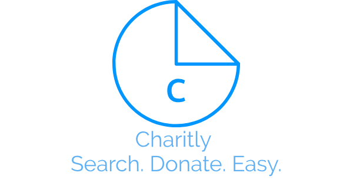
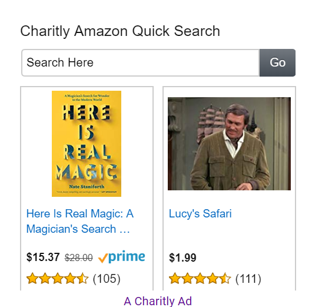

## Charitly

Non intrusive, Youtube and Amazon quick search bars directly from your Google searches! 80% of our income is donated to Charity!
Our Charitly Search Bars usually spawn in the Google Search Bar for Youtube Searches and in the side boxy things called "knowledge panels" for Amazon Searches (But on the rare, you have to scroll to see them or they are loaded in the actual search page)

[Click to download!](https://chrome.google.com/webstore/detail/charitly/oajfolkiagalddkgaabkdealabfeiebp)

We Donate to all Charities! Find Some [Here](https://www.charitynavigator.org/)

The Charitly Youtube Quicksearch (That's what we call 'em) in the Google Search Bar!

The Charitly Amazon Quicksearch in a Google knowledge panel displaying Apple Watches!

